Implementing Virtual Networking and Network Security in Microsoft Azure

Karabo Koko

09 Feb. 2026

## Introduction

In this project, I worked on setting up a secure and organized network environment in Microsoft Azure.

The goal was to create virtual networks and separate areas called subnets to help resources communicate safely. I practiced building these networks both directly through the Azure portal and by using templates. I also set up security controls to manage how different resources can talk to each other and made sure that devices and applications could find each other using public and private DNS settings.

This project gave me hands-on experience in managing cloud networks and ensuring they are both functional and secure.

## Hands-on

Method 1: create a virtual network

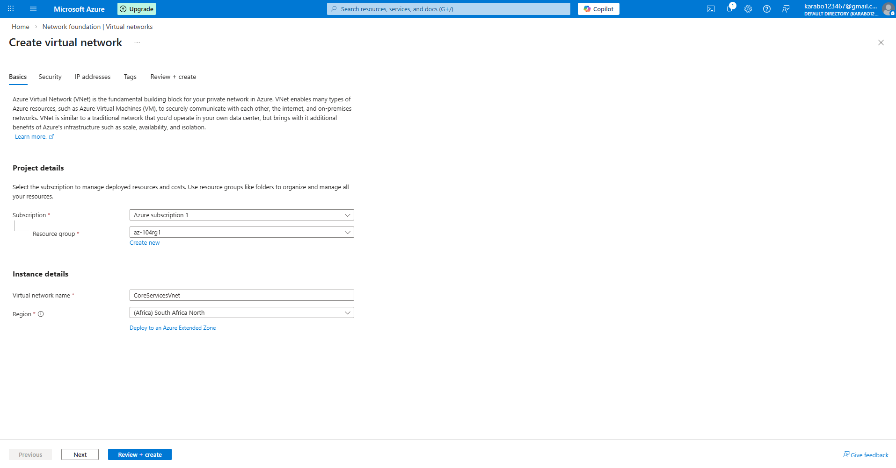

Method 2: configure your address spaces and subnets

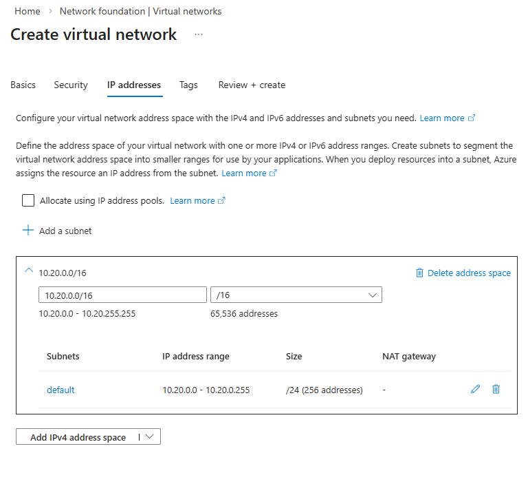

Method 3: To the vnet,create two subnets one for shared services and for the database.

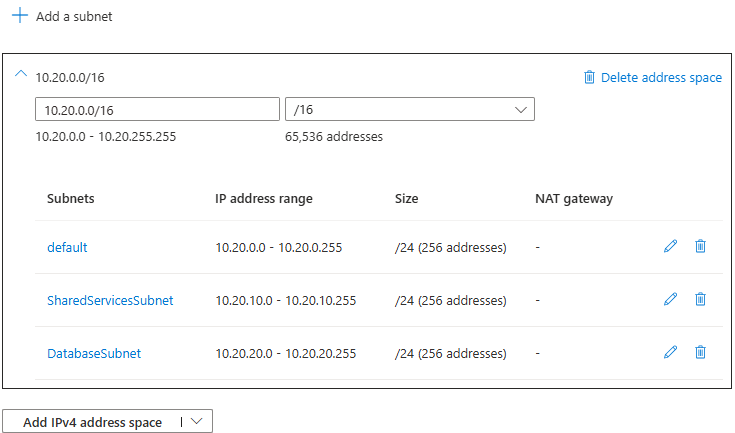

Method 4: Review if all has been included before creating the virtual network.

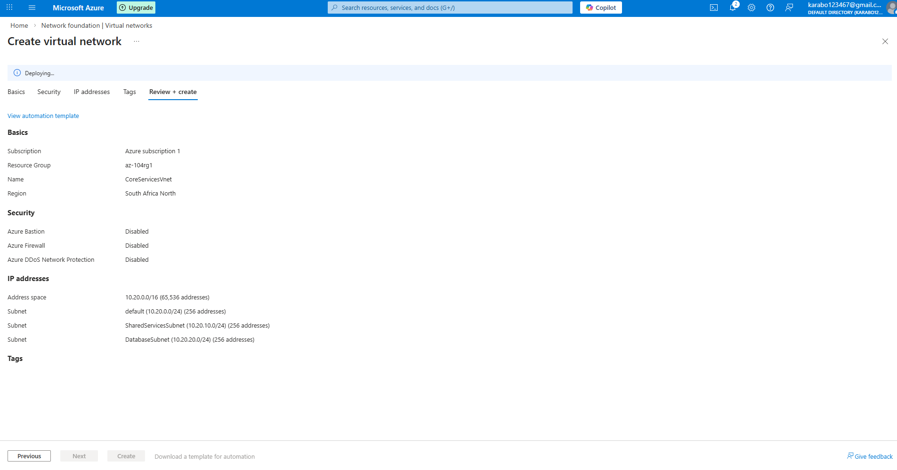

Method 5: Confirm that all resources have been created.

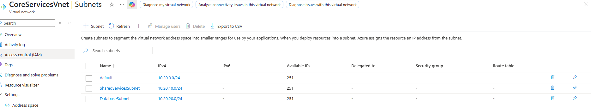

Method 6: When the vnet and subnets have been deployed, extract the resource blade under template in the automation blade.

Method 7: Open an editor of your choice I have used Visual Studio Code, and the template will look as displayed, note to download the template and parameters file.

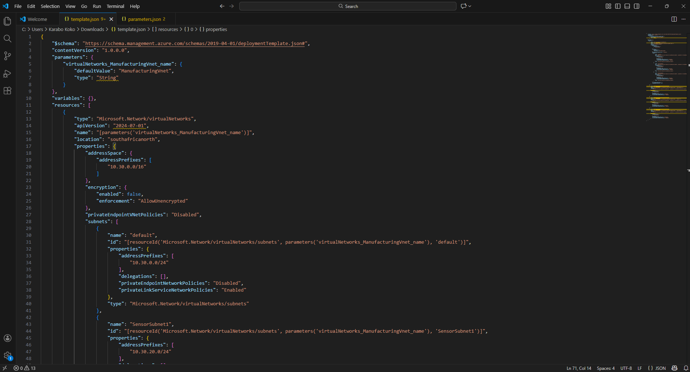

Parameters file Method 8: On VS code change occurrences that you need for the new deployment of another vnet with subnets for manufacturing. Save your changes and upload to azure portal under “deploy a custom template”Method 9: Create a Application Security Group (ASG) and Network Security Group (NSG) and allow inbound and outbound traffic.

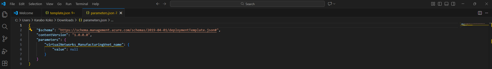

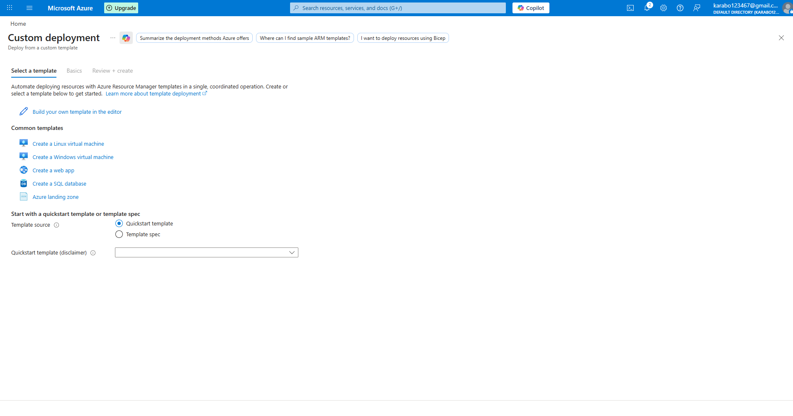

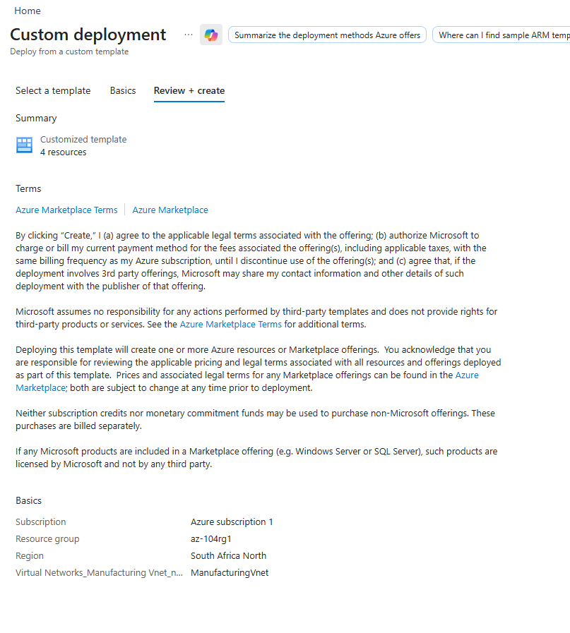

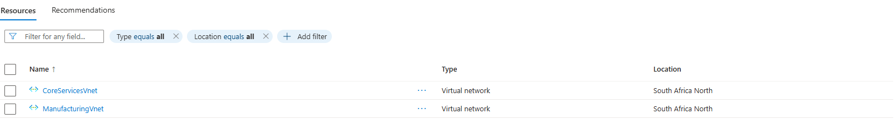

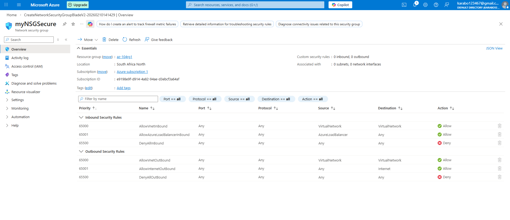

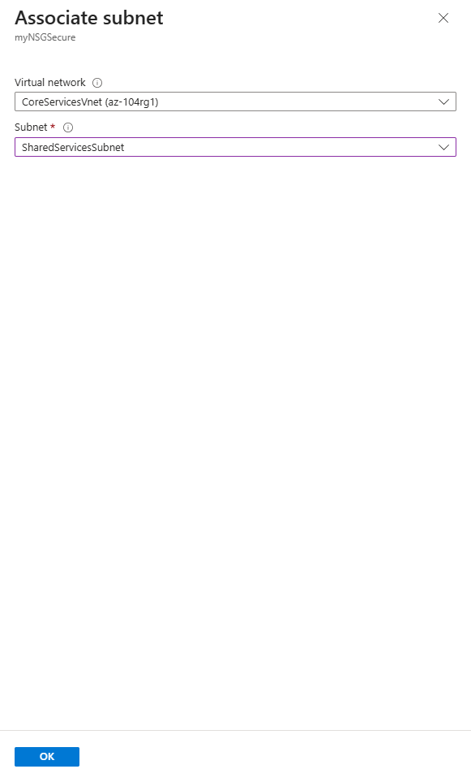

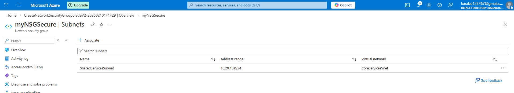

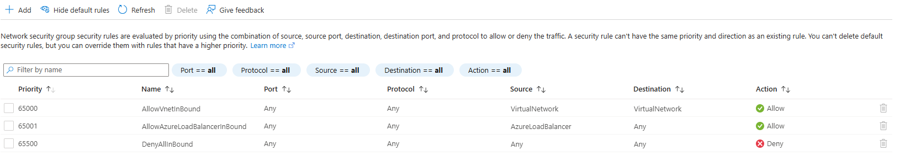

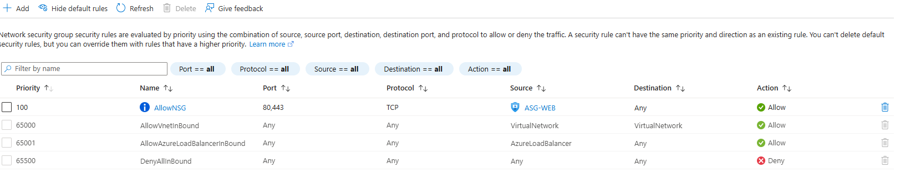

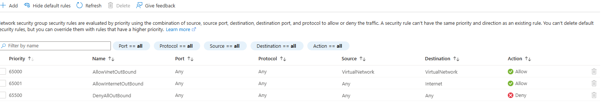

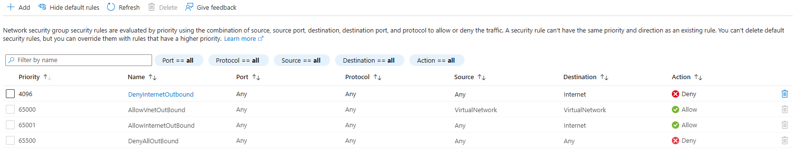

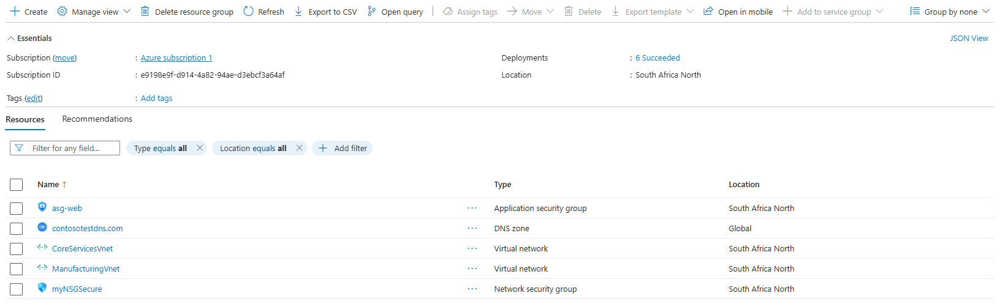

Method 10: Configure public and private DNS zones

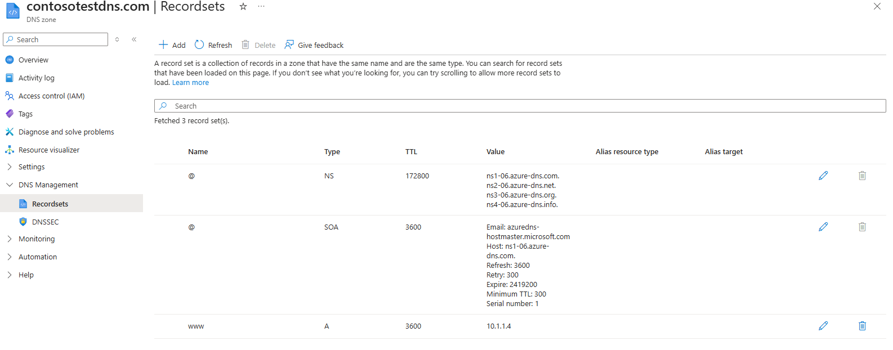

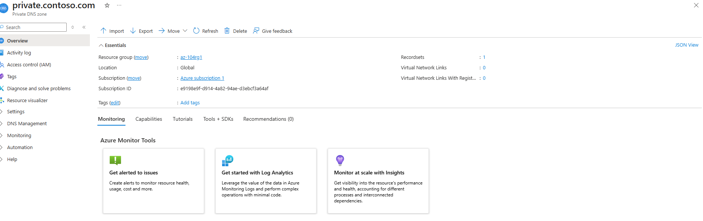

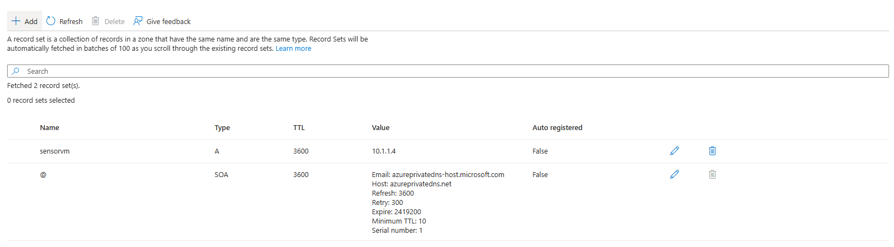

Method 11: Confirm if all the resources have been deployed and use the nslookup command for chekcing if the DNS zones pullup the IP addresses.

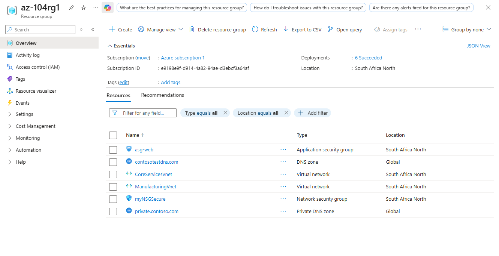

This project involved building and securing virtual networks in Microsoft Azure, creating subnets, configuring communication and DNS, and gaining hands-on experience in managing cloud networks safely and efficiently.
